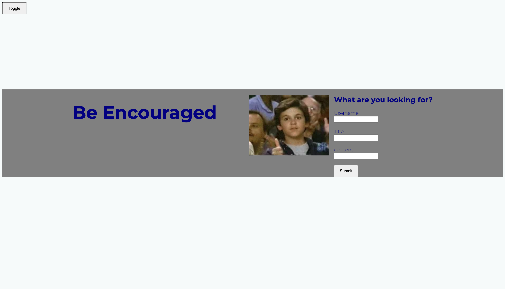

# Be Encouraged
===============

## Description

This is a form that takes you to my personal blog. When you input the username, title, and content it is then stored into the local storage. When you are redirected to my blog page you'll notice a footer with my personal contact information. Also whatever you entered into the form is displayed on the blog page. When you click the toggle button it changes the color from white to black. When you click the toggle button again it changes it back to white. 

## Finished Product 

## Credits

- I used this for help constructing a form
    - **<https://developer.mozilla.org/en-US/docs/Learn/Forms/How_to_structure_a_web_form>**
- I used this as well to help create my form with submit button
    - **<https://www.w3schools.com/html/html_forms.asp>**
- Used this MDN doc with help with the window.open function
    - **<https://developer.mozilla.org/en-US/docs/Web/API/Window/open>** 

## License

MIT see more details in repo

## Live Link

## GitHub Repo
